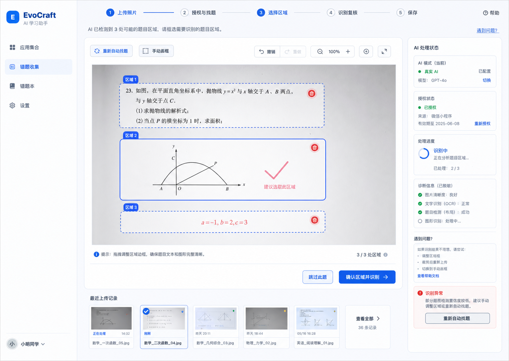
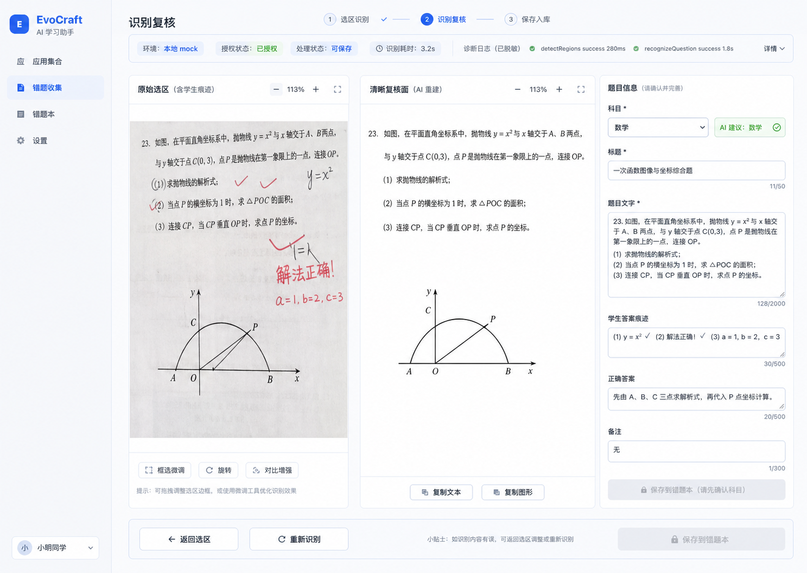
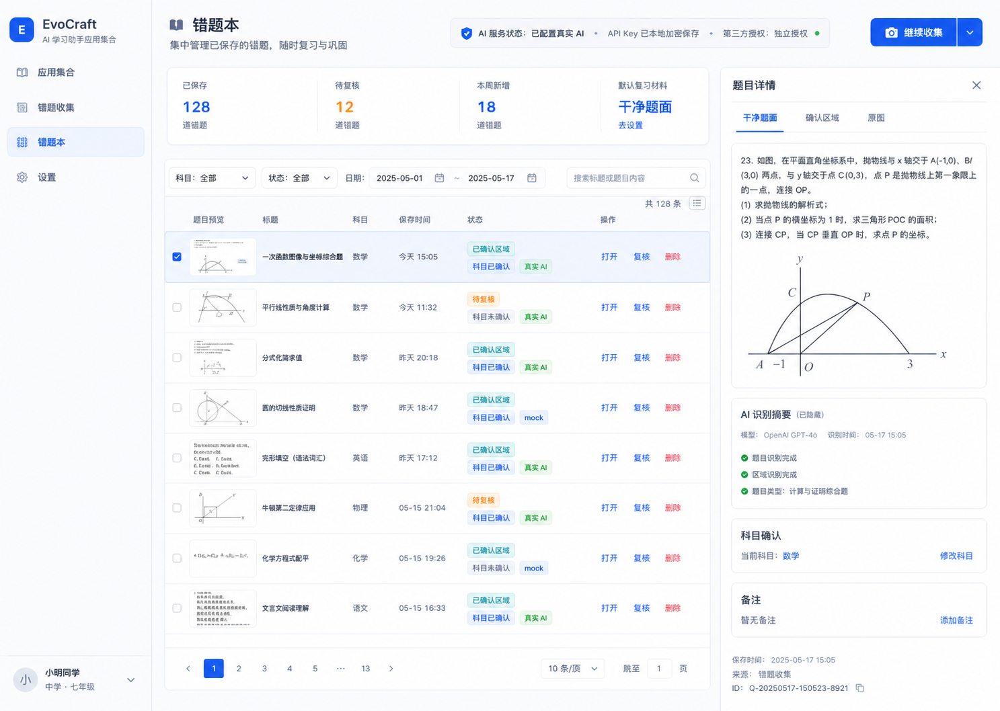

# EvoCraft 桌面错题收集 Product Design 三方向

日期：2026-06-07

状态：已选择方向 A 作为整体 UI 骨架，并吸收方向 B/C 的局部结构

相关文档：

- Product Design brief：`docs/design/2026-06-06-product-design-redesign-brief.md`
- 详细设计：`docs/superpowers/specs/2026-06-06-desktop-ai-flow-ux-redesign-design.md`
- 实施计划：`docs/superpowers/plans/2026-06-06-desktop-ai-flow-ux-redesign.md`
- React 桌面主干截图：`docs/design/desktop-trunk/`

## 1. 本轮目标

本轮 Product Design ideation 已完成，并进入 React UI 小步改造：在基础真实 AI 流程修复之后，为 EvoCraft 桌面错题收集提出 3 个可选视觉/交互方向。每个方向都覆盖真实 AI 状态、外部 AI 授权、选区画布、识别复核、错题本和设置边界。

本轮 ImageGen 已生成 3 张方向预览图，并复制到 `docs/design/product-design-directions/`。用户已确认：方向 A 作为整体 UI 骨架，同时吸收方向 B 的复核分栏和方向 C 的资料库行列表达；React UI 改造计划见 `docs/superpowers/plans/2026-06-07-flow-control-tower-ui.md`。

## 2. 共同约束

- 保留桌面应用 shell：左侧 EvoCraft 品牌和导航，中间工作区，必要时右侧状态/检查面板。
- 上传页不再前置选择科目；科目在识别后以 AI 建议和用户确认的方式出现。
- 真实 AI 配置和外部 AI 授权必须分开表达：配置 API key 不等于授权上传题目区域。
- API key 状态只显示“已本机加密保存/可更改/可清除”，不回显明文。
- 选区画布必须支持候选框选择、画布内删除、手动画框、重新自动找题和失败恢复。
- 错题本必须像学习资料库，默认展示干净题面，同时保留确认区域和原图溯源。
- 遵循当前视觉基线：可信蓝、青绿色 AI 辅助提示、少量暖黄色学习温度、8px 左右控件圆角、信息密度偏桌面工作台。

## 3. 方向 A：流程控制塔

预览图：

核心判断：

把“上传照片 -> 授权与找题 -> 选择区域 -> 识别复核 -> 保存”做成可见的阶段控制台。用户始终知道自己在哪一步、AI 卡在哪里、下一步能做什么。

适合解决：

- 真实 AI 已配置但未授权、处理中、失败、回退 mock 等状态不清楚的问题。
- 选区阶段用户不知道该点击候选框、手动画框还是重新自动找题的问题。
- 后续加真实 provider 诊断日志时，需要给开发和测试留出清晰观察位。

页面结构：

- 顶部：横向阶段条，展示当前阶段和已完成阶段。
- 中央：大画布展示上传照片和候选框，框内有删除入口，旁边保留缩放、重新找题和手动画框。
- 右侧：AI 状态 rail，分为 runtime、authorization、processing、recoverable error、redacted diagnostics。
- 底部：主行动按钮和最近记录条。

风险：

- 如果状态 rail 做得太重，可能压缩画布空间。
- 需要严格控制状态文案长度，避免变成日志面板。

建议用法：

优先作为下一轮 React UI 改造的主骨架，因为它最直接回应真实 AI 桌面试用中的“点击无反应”和“状态不可见”问题。

## 4. 方向 B：双栏复核工坊

预览图：

核心判断：

把识别后的复核页做成“原始证据 vs 干净题面”的并排工坊，右侧是结构化编辑器。用户能清楚比较原图痕迹、确认区域和 AI 清理后的可复习材料。

适合解决：

- 用户需要确认 AI 有没有误删图形、公式、表格或题干。
- 科目确认、题目文字、学生答案痕迹、正确答案和备注需要集中编辑。
- 保存前需要显式显示“AI 建议科目”和“用户确认科目”之间的差异。

页面结构：

- 顶部：紧凑阶段条和 AI 状态 strip。
- 左侧主区：确认区域和干净题面并排比较。
- 右侧 inspector：科目、标题、题目文字、学生答案痕迹、正确答案、备注。
- 底部行动：返回选区、重新识别、保存到错题本。

风险：

- 对上传和选区阶段覆盖较弱，不能单独解决整条流程的阶段感。
- 表单密度高，需要良好的输入高度和错误提示，否则会显得像后台管理页。

建议用法：

作为复核页的首选结构，可并入方向 A 的整体阶段骨架。

## 5. 方向 C：资料库中枢

预览图：

核心判断：

把错题本从 demo 列表提升为学习资料库。记录不是上传流程的尾巴，而是后续复习、分析和学习循环的入口。

适合解决：

- 错题本和最近记录不够像长期资料库的问题。
- 用户需要快速理解每条记录的科目、来源、确认状态、真实 AI/mock 处理状态。
- 后续 Phase 2 错题理解、复习队列和相似题生成需要更稳定的信息架构。

页面结构：

- 顶部：资料库 summary strip，包括已保存、待复核、本周新增、默认复习材料。
- 中部：筛选/搜索和记录列表，行内显示干净题面缩略图、标题、科目、日期、状态 chips、打开/复核/删除。
- 右侧：选中记录预览，默认干净题面，tabs 切换确认区域和原图；展示 redacted AI call summary。
- 顶部或侧边：继续收集主行动。

风险：

- 对“真实 AI 选区点击无反应”的修复感最弱。
- 如果过早围绕资料库重构，会分散当前 MVP 的上传/识别核心。

建议用法：

作为错题本和详情页的目标方向，等方向 A/B 稳定后再落地。

## 6. 推荐推进顺序

已选择方向 A 作为整体 UI 骨架，同时吸收方向 B 的复核分栏和方向 C 的资料库行列表达。

原因：

- 当前最急的问题是桌面真实 AI 流程可见、可诊断、可恢复。
- 方向 A 对上传、授权、选区、识别和失败恢复覆盖最完整。
- 方向 B 和方向 C 更适合分别作为局部页面模式，而不是整套应用的唯一主方向。

落地边界：

- 方向 A 落为上传、选区、复核、详情和错题本共用的阶段导航与 AI 状态 rail。
- 方向 B 落为复核页的“原始证据 / 清晰复核面 / 题目信息”三分区。
- 方向 C 落为错题本 overview summary 和行列表格，不提前重构 Phase 2 学习分析能力。
- 本轮不改变 MVP PRD v1.10 的需求边界、AI provider 契约、隐私授权边界或本地数据形态。

## 7. 下一步选型标准

后续视觉验收优先看 4 个问题：

1. 用户是否能在 5 秒内判断当前处于上传、选区、复核还是保存阶段。
2. 真实 AI 未配置、未授权、处理中和失败时，主行动是否明确且可恢复。
3. 候选框选择/删除/手动画框是否比当前版本更直接。
4. 保存后的错题是否像可长期复习的资料，而不是临时识别结果。

方向 A 已进入小步 React UI 改造；后续继续按阶段导航、状态 rail、复核分栏和资料库行列表达做截图回归，不一次性重做全站。
