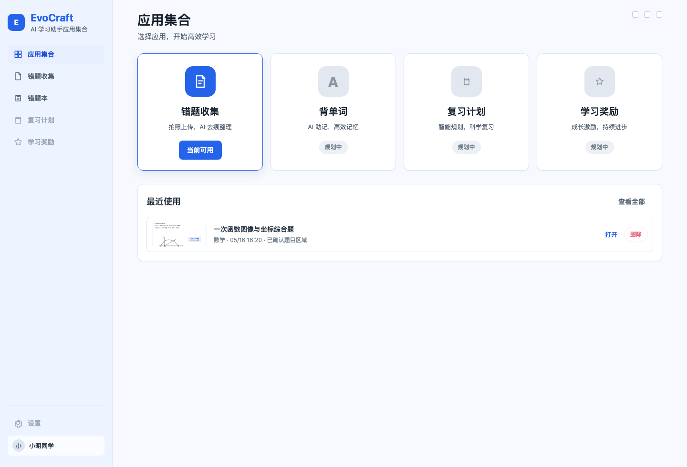
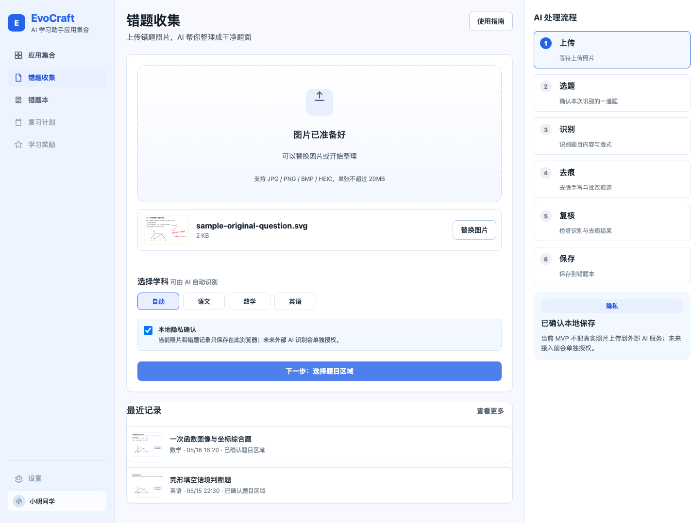
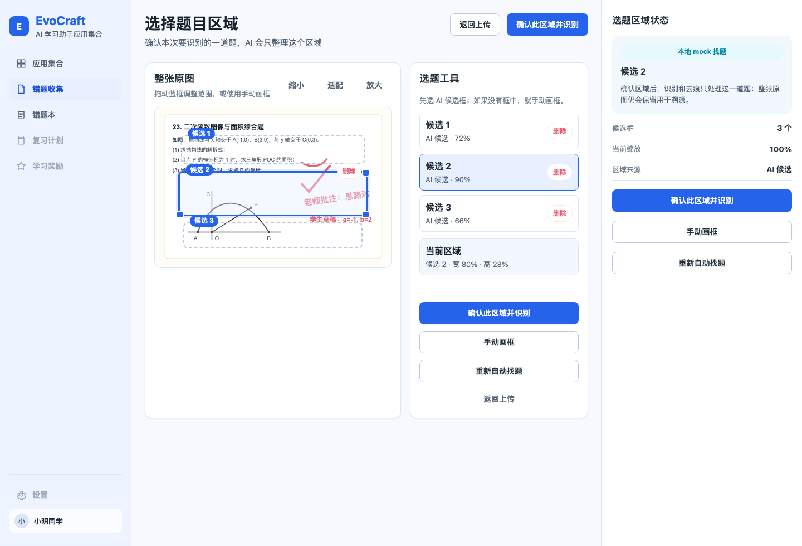
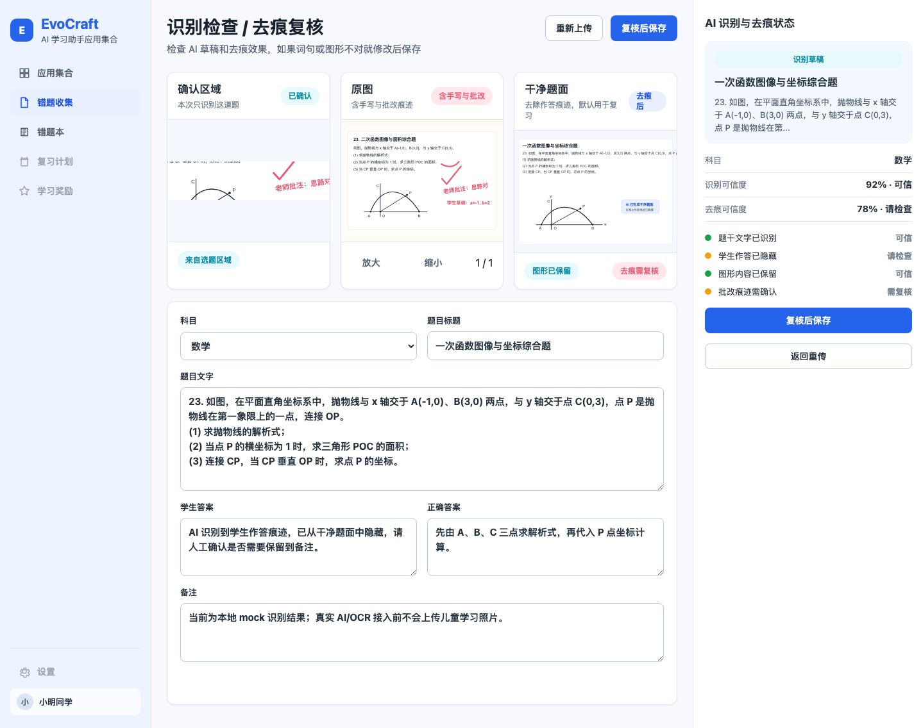
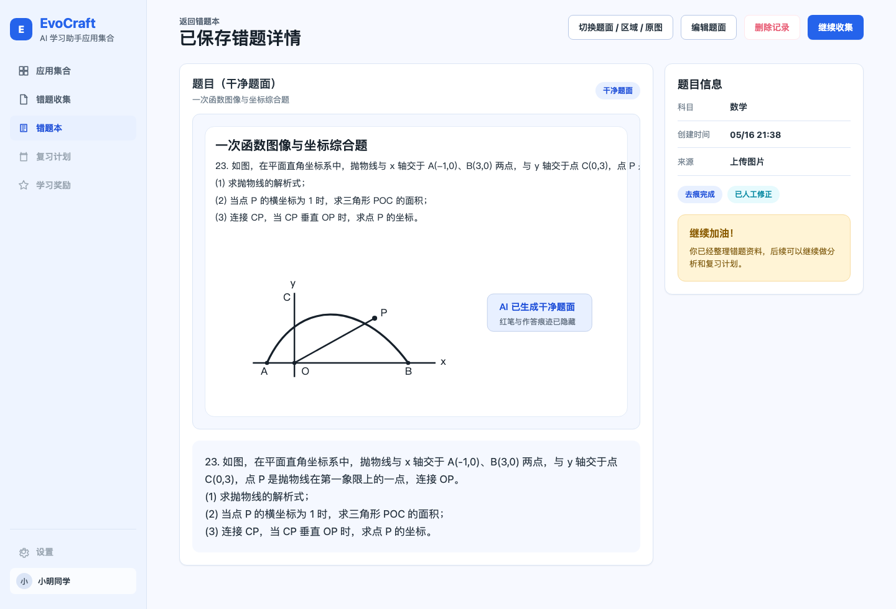
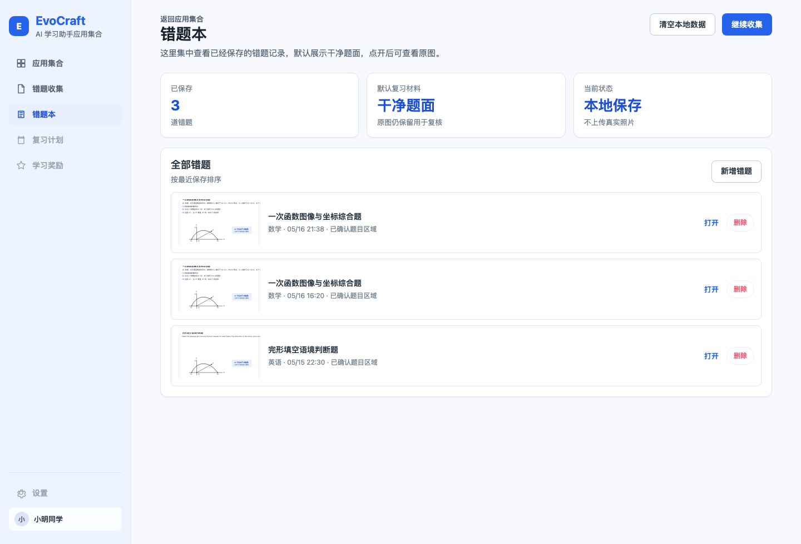

# 2026-05-16 已实现 MVP UI 设计图

## 用途

这组设计图把当前静态 Web MVP 的真实实现状态保存为技术路线决策前的 UI 基线。它不是重新绘制的理想稿，而是由 `app/` 当前实现自动跑通主流程后截取的页面图，用于后续判断哪些复杂度来自真实界面、哪些仍只是规划。

## 生成方式

- 生成脚本：`docs/design/implemented-mvp/capture-ui.mjs`
- 示例原图：`docs/design/implemented-mvp/assets/sample-original-question.svg`
- 运行命令：`node docs/design/implemented-mvp/capture-ui.mjs`
- 输出目录：`docs/design/implemented-mvp/screens/`

脚本会启动临时本地静态服务，用 Chrome headless 打开 `app/index.html`，准备示例错题记录，走完上传、隐私确认、选题区域、复核、保存、详情和错题本流程，并覆盖生成以下 PNG。

## 页面设计图

### 01. 应用集合首页

### 02. 上传与本地隐私确认

### 03. 选择题目区域

### 04. 识别检查与去痕复核

### 05. 已保存错题详情

### 06. 错题本列表

## 设计基线结论

- 当前 MVP 已覆盖 App Hub、上传、隐私确认、选题区域、候选框删除、手动画框入口、复核编辑、保存、错题本列表和详情查看。
- 现有 UI 仍适合作为静态 Web MVP 继续试用，但已经出现多页面状态、列表布局、候选框交互和错误恢复的维护压力。
- 进入技术路线决策时，应把这些截图视为当前产品表面积：AI adapter 和真实 OCR 接入会增加异步状态、供应商状态、失败恢复、进度展示和测试复杂度。
- 设计图生成过程中发现并修复了错题本列表布局回归：父级列表应保持两个直接子元素布局，图片、标题和打开入口应在 `.record-open` 内部完成三列布局。
