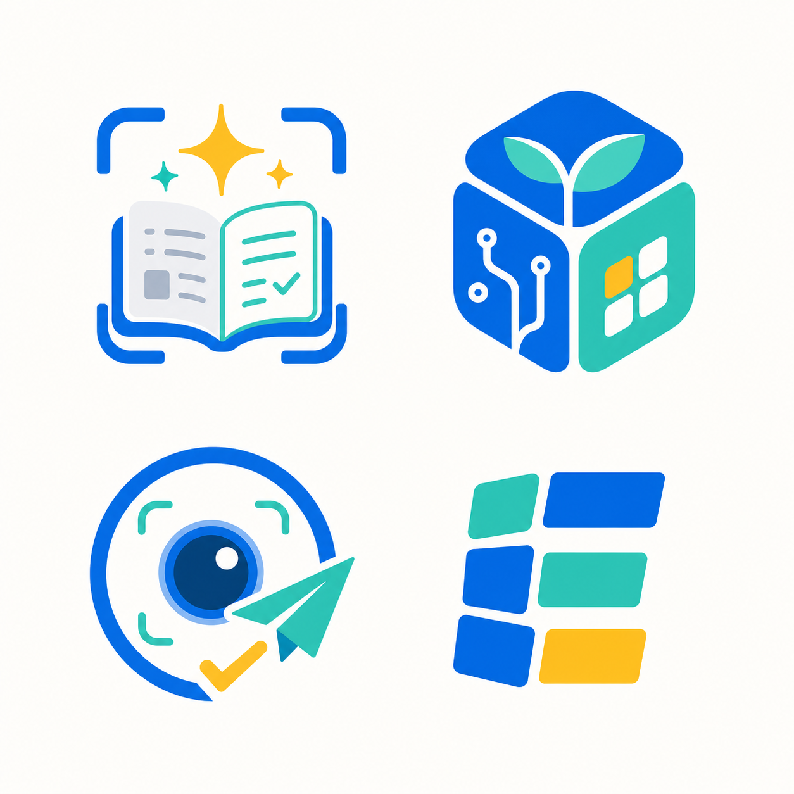

# EvoCraft Logo Options

日期：2026-05-18

## 目标

为 EvoCraft 探索第一组应用 logo 方向。EvoCraft 当前定位是面向上海孩子和家长的 AI 学习助手应用集合，第一阶段从桌面端错题收集开始。Logo 需要同时表达：

- 可信的 AI 学习工具，而不是普通拍题软件。
- 应用集合和长期成长空间，而不是只服务一个错题功能。
- 轻度游戏化和 Craft 感，但不幼稚、不做玩具化吉祥物。

## 方案图



## 四个候选方向

### A：扫描框 + 打开笔记 + 星光

适合作为 `错题收集` 应用图标。它最直接表达“从照片中整理出干净题面”，和当前 MVP 的核心闭环贴合度最高。

优点：功能识别强、和现有错题收集流程一致、适合放在 App Hub 的第一个应用卡片上。

风险：如果作为 EvoCraft 总品牌，会略显单功能，容易被理解成只做扫描/错题。

### B：成长方块 + 叶片 + 电路线

最适合作为 EvoCraft 总品牌候选。方块表达应用集合和 Craft，叶片表达孩子的成长，电路线表达 AI 能力，整体仍然保持学习工具的可信感。

优点：品牌延展性最好，能覆盖错题、背单词、复习计划、游戏化成长等后续应用。

风险：需要进一步简化内部细节，保证 16px/32px 小尺寸下仍然清楚。

### C：识别镜头 + 纸飞机 + 勾选

适合作为上传、识别、处理成功等流程动作图标。它强调“拍照识别后继续前进”的动作感。

优点：动势强，适合功能按钮或桌面上传入口。

风险：镜头符号太强，作为总 logo 时会把 EvoCraft 拉回“拍题/扫描工具”的单点认知。

### D：模块化 E 字母

适合作为更抽象的 App Hub / 工具箱方向。模块卡片能表达应用集合、知识卡片和可扩展能力。

优点：最简洁，后续矢量化和小尺寸适配成本低，适合做 dock 图标基础形。

风险：学习、AI、成长语义较弱，需要搭配 wordmark 或品牌系统补足含义。

## 推荐

优先推荐 B 作为 EvoCraft 总品牌方向，A 作为 `错题收集` 子应用图标方向。

具体落地建议：

- EvoCraft App logo：采用 B 的“成长方块”方向，进一步简化为一个蓝色圆角立方体、青绿色生长线和一个暖黄色模块点。
- 错题收集 app icon：采用 A 的“扫描框 + 打开笔记”方向，作为 App Hub 内的第一个应用图标。
- 上传/识别状态图标：从 C 抽取镜头、框选和勾选元素。
- App Hub 或桌面侧栏小标识：从 D 抽取模块化 E，用作极小尺寸备用标识。

## A 方向精修版

用户选择继续沿左上 A 方向优化，因此追加一版更接近可落地 app icon 的稿件：


本版保留“扫描框 + 打开笔记 + 星光 + 勾选”的核心语义，但做了这些收敛：

- 扫描框加粗，减少断点数量，提高小尺寸识别。
- 笔记本从复杂页面收敛为两页结构，只保留抽象线条和一个内容块。
- 勾选集中放在右页，表达“整理完成/可保存”。
- 黄绿色点缀减少为两个星光，保持 AI 整理和孩子成长感，但避免玩具化。
- 增加浅色圆角 app icon 背板，便于后续评估 dock、App Hub 和 Electron icon 使用。

下一步如果继续用这个方向，应做矢量化重绘，并分别检查 16/32/64/256/512 像素下扫描框、书脊和勾选是否仍然可读。

## 选定稿：扫描笔记 Final Candidate

用户确认继续使用扫描笔记方向，并要求“就是它了”。基于 v2 再做一轮比例、线条和留白精修后，当前选定稿如下：


相比 v2，本版调整重点：

- 扫描框四角的比例更均衡，端点没有继续加重，避免在小尺寸里糊成一块。
- 书本中轴、底部弧线和右页外轮廓更清楚，图标语义更稳定。
- 右页只保留三条抽象内容线和一个勾选，降低真实文字感。
- 星光整体收敛，保留 AI 整理的轻微仪式感，但不让图标显得幼稚。
- 画面重心更居中，适合作为 App Hub、桌面 dock 和后续 Electron icon 的基础图。

基础小尺寸预览已导出到 `docs/design/logo/previews/`：

- `2026-05-18-evocraft-logo-scan-notebook-final-16.png`
- `2026-05-18-evocraft-logo-scan-notebook-final-32.png`
- `2026-05-18-evocraft-logo-scan-notebook-final-64.png`
- `2026-05-18-evocraft-logo-scan-notebook-final-128.png`

当前选定稿已进入第一轮生产接入：

- React 应用内品牌位和 App Hub 错题收集卡片使用 `src/assets/evocraft-logo.png`。
- 浏览器/桌面 renderer favicon 使用 `public/favicon.png`。
- Electron builder 的 macOS app icon 使用 `build-resources/icon.icns`。
- 公开静态预览图使用 `public/evocraft-logo.png`。

后续发布前仍建议做一版矢量重绘，并补齐透明背景、Windows `.ico`、不同平台安全边距检查和真实 dock/installer 视觉验收。

## 视觉规范建议

- 主色：AI 可信蓝，接近当前 UI 基线。
- 辅助色：青绿色，用于成长、确认、整理完成。
- 点缀色：暖黄色，只用于 spark、模块点或成功反馈，不要大面积铺色。
- 形状：8px 到 16px 圆角的几何块面，避免过圆导致玩具化。
- 避免：吉祥物、动物、毕业帽、铅笔、复杂手写文字、泛化 AI 脑图标、过强相机隐喻。

## 生成提示词

```text
Use case: logo-brand
Asset type: EvoCraft app logo exploration contact sheet, four vector-friendly logo mark options for a desktop-first AI learning assistant app for children and parents.
Primary request: Create 4 distinct logo mark concepts for EvoCraft, arranged in a clean 2x2 grid on a plain off-white background. No wordmark, no readable text, no tiny labels, no watermark.
Brand context: EvoCraft is a trustworthy AI learning workspace for Shanghai children. First app captures wrong-question photos and turns them into clean, reusable study records. Tone is serious learning tool with a light growth/craft/game feel, not a toy and not a generic camera app.
Visual directions:
1. Spark + open notebook + subtle crop frame: AI helps turn messy homework into clean knowledge.
2. Rounded cube/seed + circuit leaf: a child builds a growing study world over time.
3. Lens + paper plane/check mark: capture, organize, and move forward confidently.
4. Modular E monogram made from tiles/cards: app collection / learning toolbox identity.
Style: premium but friendly, simple geometric shapes, vector logo aesthetics, app-icon ready, crisp edges, minimal gradients, balanced blue primary with teal/mint accent and a small warm yellow highlight where useful. Avoid dominant purple, beige, dark slate, or brown/orange themes. Avoid mascots, animals, overly childish cartoons, complex scenes, handwriting, textbooks full of text, pencils, graduation caps, and generic AI brain icons.
Composition: Each mark centered in its own equal square area with generous padding. Use consistent visual weight across the four options. Flat or very subtle depth only. High legibility at small icon size.
```

## A 方向精修版生成提示词

```text
Use case: logo-brand
Asset type: single optimized EvoCraft sub-app icon / logo mark based on the previous top-left concept.
Primary request: Create one polished app-icon-ready logo mark for EvoCraft's wrong-question capture app. The mark should be inspired by the top-left option from the prior contact sheet: a subtle AI crop/scan frame around an open notebook, with one clean check mark and one simple sparkle. No wordmark, no readable text, no labels, no watermark.
Brand context: EvoCraft is a trustworthy AI learning workspace for Shanghai children and parents. This sub-app captures a wrong-question photo and turns it into a clean reusable study record. It should feel like a serious learning tool with a small warm growth/craft feeling, not a toy and not a generic scanner.
Composition: Centered single mark inside a soft rounded-square app icon canvas. Use a white or very pale cool background. The notebook should be simplified to two open pages with only abstract short lines and one small visual block, not real text. The scan frame should be blue, thick enough to read at small sizes, and integrated around the notebook without clutter. Add one warm yellow sparkle above the notebook and one small teal sparkle or accent. Keep generous padding.
Style: modern vector logo aesthetics, crisp geometric edges, simple shapes, app icon ready, high legibility at 16/32/64 px, minimal subtle depth only. Blue primary, teal/mint secondary, tiny warm yellow highlight. Avoid dominant purple, beige, dark slate, brown/orange palettes. Avoid mascots, animals, pencils, graduation caps, realistic paper texture, camera lens, complex documents, handwriting, Chinese or English text, AI brain icons, heavy gradients, and dense line details.
Output: a single square image, clean centered logo, no surrounding mockup, no multiple options.
```

## 选定稿生成提示词

```text
Use case: logo-brand
Asset type: final polished EvoCraft app/sub-app icon, refined from the visible scan-notebook v2 reference.
Primary request: Refine the visible logo without changing its core concept. Keep the same identity: a bold blue AI scan/crop frame surrounding an open notebook, teal right page outline, one clean teal check mark, one warm yellow sparkle and one smaller teal sparkle. No wordmark, no readable text, no labels, no watermark.
Refinement goals: make it feel like the final chosen app icon. Improve proportion, centering, symmetry, spacing, edge crispness, and small-size readability. Reduce visual noise. Make the scan frame corners more evenly balanced and slightly less bulky at the ends. Make the notebook spine and bottom curve cleaner and more iconic. Simplify the left page to abstract non-text strokes and one soft content block. Make the right page and check mark clean, confident, and not crowded. Keep the stars smaller and better integrated so they feel premium, not childish.
Brand context: EvoCraft is a trustworthy AI learning workspace for Shanghai children and parents. This icon represents capturing a wrong-question photo and turning it into a clean reusable study record. It should feel serious, helpful, and warm.
Composition: single centered mark on a soft rounded-square app icon canvas. White or very pale cool background. Generous padding. Slight soft depth is acceptable, but keep it vector-friendly and simple.
Style: polished modern vector logo aesthetics, crisp geometric edges, minimal subtle gradient, app icon ready, high legibility at 16/32/64 px. Use AI trustworthy blue as primary, teal/mint as secondary, tiny warm yellow highlight. Avoid purple, beige, dark slate, brown/orange palettes. Avoid mascots, animals, pencils, graduation caps, camera lenses, complex documents, handwriting, Chinese or English text, AI brain icons, heavy shadows, dense line details, or multiple options.
Output: one square image, final single logo candidate only.
```
