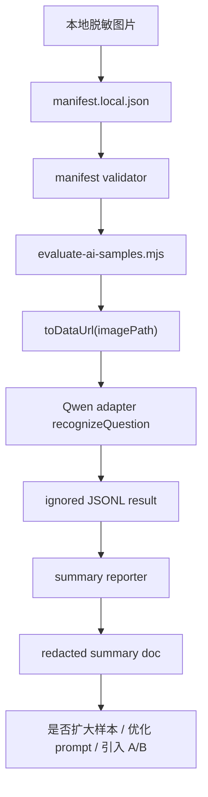

# Qwen 脱敏样本评测设计

日期：2026-05-31

文档状态：已确认方案，待实施计划执行

适用阶段：真实 AI 识别接入后，进入小样本效果验证阶段

相关文档：

- `docs/superpowers/specs/2026-05-23-real-ai-recognition-design.md`
- `docs/superpowers/plans/2026-05-23-real-ai-recognition.md`
- `docs/superpowers/agent-runs/2026-05-23-real-ai-recognition/README.md`
- `ai-eval/README.md`
- `ai-eval/samples/manifest.example.json`
- `scripts/evaluate-ai-samples.mjs`
- `electron/ai/qwenAdapter.cjs`
- `docs/planning/evocraft-project-memory.md`
- `docs/planning/evocraft-roadmap-progress.md`

## 1. 背景

桌面本地优先的真实 AI 识别迁移已经合入 `main`。当前应用具备：

- Electron main process 中的真实 AI IPC。
- Qwen adapter spike。
- 本机 AI eval runner。
- 本地样本与结果目录的 git ignore 保护。
- 外部 AI 授权和本地文件读取边界。

下一步不是继续改 UI 或扩大模型能力，而是先用 10-15 张脱敏样本验证 Qwen 链路是否能稳定完成“识别整理”。评测结论会决定是否扩大到 50 张、是否调整 prompt/schema、是否引入第二供应商 A/B。

## 2. 目标

本阶段目标：

- 建立可重复的 Qwen 小样本评测流程。
- 用 10-15 张语文、数学、英语混合脱敏样本验证当前 schema、prompt 和 adapter 输出。
- 记录结构化、可复盘、可对比的评测结果。
- 只提交红线安全的聚合结论，不提交真实儿童照片、原始 OCR 全文、API key 或完整 provider 响应。
- 给出下一阶段判断：继续优化 Qwen、扩大样本、还是引入第二供应商。

成功标准：

- 本地 manifest 能被静态校验，样本路径不能逃逸出 `ai-eval/samples/`。
- eval runner 只在 `EVOCRAFT_AI_EVAL_ENABLED=1` 且本地有 `DASHSCOPE_API_KEY` 时调用云端。
- 每个样本生成一条 JSONL 原始结果，留在 ignored 的 `ai-eval/results/`。
- 评测总结只输出非敏感指标、失败原因、人工修正点和下一步建议。
- 结论能回答：当前 Qwen 链路是否足够进入更大样本，还是必须先调整 prompt/schema。

## 3. 非目标

本阶段明确不做：

- 不训练、微调或本地部署模型。
- 不接入火山豆包或 OpenAI 作为第二供应商。
- 不做解题、讲解、错因、知识点、相似题。
- 不做图像去痕、重绘或 inpainting。
- 不提交真实样本图片、`manifest.local.json`、`.env*` 或 `ai-eval/results/*.jsonl`。
- 不把完整 OCR 文本、儿童作答内容或 provider 原始响应复制进提交文档。
- 不修改 Electron 生产调用链路，除非评测暴露出必须先修的 blocker。

## 4. 样本范围

第一轮样本数：10-15 张。

科目配比：

- 数学：4-6 张，至少包含公式题、几何图/坐标图、应用题。
- 语文：3-5 张，至少包含阅读题、填空题、主观题中的两类。
- 英语：3-5 张，至少包含选择题、完形/阅读理解、短句填空中的两类。

图片状态标签：

- `clear`
- `tilted`
- `shadow`
- `blurred`
- `multi-question-page`
- `student-writing`
- `teacher-markup`
- `formula`
- `geometry`
- `table`
- `reading`
- `choice`

样本脱敏要求：

- 不包含孩子姓名、学校、班级、电话、住址、准考证号或二维码。
- 如果照片中有可识别个人信息，必须先本地裁剪或遮挡。
- 样本文件放在 `ai-eval/samples/private/` 或 `ai-eval/samples/<local-folder>/`，这些路径默认被 `.gitignore` 忽略。
- `manifest.local.json` 只在本机存在，不提交。

## 5. Manifest 合同

本阶段使用 `schemaVersion: 1`，本地 manifest 形态如下：

```json
{
  "schemaVersion": 1,
  "samples": [
    {
      "id": "math-geometry-001",
      "subject": "math",
      "imagePath": "private/math-geometry-001.jpg",
      "labels": ["geometry", "student-writing", "teacher-markup"],
      "expected": {
        "targetQuestion": "人工确认区域中的一道题",
        "mustNotInferAnswer": true,
        "mustPreserveVisualElements": ["geometry-diagram"],
        "notes": "几何图需要保留为视觉片段或复核项"
      }
    }
  ]
}
```

字段规则：

- `schemaVersion` 必须是 `1`。
- `samples` 必须是非空数组。
- `id` 必须唯一，使用小写字母、数字和短横线。
- `subject` 必须是 `chinese`、`math`、`english` 或 `auto`。
- `imagePath` 必须是相对路径，且 resolve 后必须仍在 manifest 所在目录或 `ai-eval/samples/` 下。
- `labels` 必须是字符串数组。
- `expected.mustNotInferAnswer` 必须为 `true`。
- `expected.mustPreserveVisualElements` 是字符串数组，用于人工评估图形/表格/公式保留。

## 6. 数据流



关键边界：

- 图片只从本地读入 runner。
- 发送给 provider 的图片必须是 data URL，不是 `file://`。
- API key 只来自本地环境变量。
- JSONL 原始结果留在 ignored 目录。
- 提交进仓库的总结必须先删去题干全文、作答全文和 provider 原文。

## 7. 评测维度

每个样本人工评估这些维度：

| 维度 | 通过标准 | 失败记录 |
| --- | --- | --- |
| Provider 可调用性 | 返回 `ok: true` 或明确可恢复失败 | `real_ai_disabled`、认证失败、网络失败、schema 失败 |
| JSON 合法性 | adapter 输出符合 `AiAdapter` 合同 | `provider_response_invalid` |
| 科目判断 | 显式科目不被覆盖，`auto` 能返回合理科目 | `subject_mismatch` |
| OCR 完整度 | 主体题干和选项可进入可编辑草稿 | `missing_stem`、`missing_options` |
| 视觉元素 | 公式、图形、表格被保留或标记复核 | `visual_lost` |
| 作答/批改痕迹 | 学生作答和老师批改不被当成干净题干事实 | `markup_misclassified` |
| 编造风险 | 不主动给出模型推理答案 | `invented_answer` |
| 可恢复性 | 失败时能保留人工填写路径 | `unrecoverable_failure` |
| 延迟 | 单样本耗时可接受并被记录 | `slow_call` |

第一轮不计算复杂分数，只输出：

- `pass`
- `pass_with_review`
- `fail_prompt_or_schema`
- `fail_provider_or_config`
- `fail_sample_quality`

## 8. 结果产物

本地忽略产物：

- `ai-eval/samples/manifest.local.json`
- `ai-eval/samples/private/**`
- `ai-eval/results/result-*.jsonl`
- `ai-eval/results/summary-*.json`

可提交产物：

- `docs/testing/ai-eval/YYYY-MM-DD-qwen-sample-evaluation-summary.md`

提交版 summary 只允许包含：

- 样本数量、科目分布、标签分布。
- 成功/需复核/失败数量。
- 失败原因计数。
- 延迟分布。
- schema/prompt 问题列表。
- 不含题干全文的匿名样本编号。
- 下一步建议。

提交版 summary 不允许包含：

- 原图、区域图或图片 base64。
- 真实题干全文。
- 孩子作答全文。
- 老师批语全文。
- provider 原始响应全文。
- API key、请求 header、完整请求体。

## 9. 隐私和安全

默认原则：

- 评测样本是儿童学习敏感资料，按本地私有文件处理。
- 只有用户主动准备脱敏样本并设置 `EVOCRAFT_AI_EVAL_ENABLED=1` 时才允许调用 provider。
- 每次运行前确认 `.gitignore` 对私有样本和结果仍生效。
- 每次提交前运行 tracked-secret/generated-artifact 检查。

必须阻断：

- `manifest.local.json` 被 staged。
- `ai-eval/samples/private/**` 被 staged。
- `ai-eval/results/*.jsonl` 被 staged。
- `.env*` 被 staged。
- summary 中包含 `data:image/`、`DASHSCOPE_API_KEY`、`Authorization`、大段 OCR 文本或 provider 原始响应。

## 10. 错误处理

runner 和 summary 工具需要明确处理：

- manifest JSON 解析失败：退出 `2`，指出文件路径和解析错误。
- 样本数量不在 10-15：默认退出 `2`；允许显式 `--allow-small-set` 用于开发自测。
- 重复样本 id：退出 `2`。
- 非法 subject：退出 `2`。
- 样本图片不存在：退出 `2`。
- 图片路径逃逸：退出 `2`。
- 未设置 eval enable flag：退出 `2`，不调用 provider。
- 未设置 API key：退出 `2`，不调用 provider。
- provider 失败：写入该样本失败结果，继续后续样本。
- JSONL 行损坏：summary 工具记录 `malformed_row_count`，不崩溃。

## 11. 测试策略

代码层测试：

- `tests/ai-eval-config.test.mjs`：继续覆盖 ignore、runner gate、manifest example 和 runner 关键边界。
- 新增或扩展 manifest validation 测试：非法 subject、重复 id、路径逃逸、缺失图片、样本数量 gate。
- 新增 summary reporter 测试：聚合 ok/fail/review、失败原因、延迟分布，并验证输出不包含敏感字段。

命令层验证：

```bash
npm run test:ai-eval-config
npm test
git diff --check
git ls-files -- .env .env.local '.env.*' ai-eval/.env ai-eval/.env.local 'ai-eval/.env.*' ai-eval/samples/manifest.local.json ai-eval/samples/private/math.jpg ai-eval/results/result-123.jsonl release dist
```

真实样本运行：

```bash
EVOCRAFT_AI_EVAL_ENABLED=1 DASHSCOPE_API_KEY=<local-only> node scripts/evaluate-ai-samples.mjs ai-eval/samples/manifest.local.json ai-eval/results/result-<date>.jsonl
```

真实样本运行只在本地有脱敏样本和 API key 后执行。

## 12. 决策

已选方案：

- 先做 Qwen 单供应商小样本评测，不并行做第二供应商。
- 先强化 manifest 校验和 summary reporter，再跑 10-15 张样本。
- 原始 JSONL 留在 ignored 目录，提交版只保留 redacted summary。
- 样本评测结果决定下一阶段，而不是预设一定扩大到 50 张。

拒绝方案：

- 直接开始 50 张样本：第一轮 schema/prompt 风险还未暴露，成本和人工 review 负担过高。
- 直接接入火山豆包 A/B：没有 Qwen 问题画像前，第二供应商只会放大实现和评测复杂度。
- 提交完整 OCR 和 provider 原文：不符合儿童学习照片隐私边界。
- 在当前迁移 PR 分支继续做评测：迁移阶段已合入 `main`，下一阶段需要独立分支和独立记录。

## 13. 开放问题

- 第一批脱敏样本由用户提供，还是先用公开/自制非儿童样本做 runner dry-run。
- 第一轮样本目标年级范围是否限定小学，还是覆盖初中。
- 单样本延迟阈值先用多少作为 `slow_call`，建议第一轮先记录分布，不设置硬失败。
- 如果 Qwen 对几何/公式效果不足，先调整 prompt/schema，还是直接引入第二供应商 A/B。

## 14. 自检

- 设计只覆盖识别整理评测，没有进入解题、讲解或相似题。
- 设计没有要求提交真实样本、原始 OCR 全文或 provider 响应。
- 设计保留本地优先和显式 provider 调用 gate。
- 设计能拆成 manifest validation、summary reporter、local run、review decision 四个可验证任务。
- 设计给出了下一阶段是否扩大样本或引入 A/B 的判断依据。
