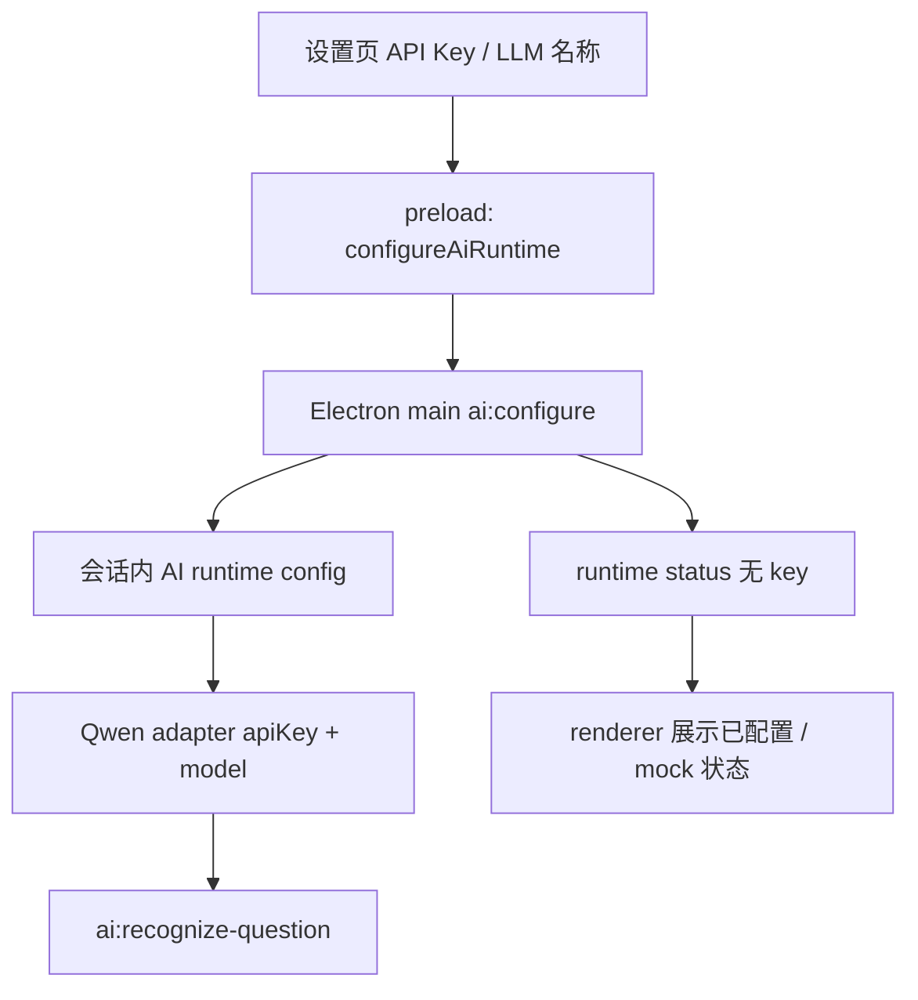

# EvoCraft 应用内真实 AI 配置设计

日期：2026-06-02

文档状态：已确认设计，已实现并补充非桌面配置 guard

适用阶段：Phase 1 错题收集桌面版真实 AI 测试模式

相关文档：

- `docs/prd/2026-05-10-wrong-question-capture-mvp-prd.md`
- `docs/superpowers/specs/2026-05-23-real-ai-recognition-design.md`
- `docs/superpowers/plans/2026-06-02-app-visible-ai-config.md`
- `docs/planning/evocraft-project-memory.md`
- `docs/planning/evocraft-roadmap-progress.md`
- `src/app/App.tsx`
- `electron/main.cjs`

## 1. 背景

当前真实 AI 路径已经具备 Electron main process IPC、Qwen adapter、外部 AI 授权 gate 和本地文件读取边界，但桌面应用运行时仍依赖环境变量读取 `DASHSCOPE_API_KEY`。用户明确不希望把“去环境变量里输入 API key”作为产品设计，要求应用中有清晰的配置界面，明确显示 API key 和 LLM 名称。

这是产品边界变化，不只是实现细节。真实 AI 的启用方式必须从“隐藏在开发环境里”改成“应用可见、用户可理解、main process 受控持有”。

## 2. 范围

本轮实现：

- 左侧导航中的 `设置` 变为可进入页面。
- 设置页提供 `API Key` 和 `LLM 名称` 字段。
- 用户提交配置后，通过 preload IPC 发送给 Electron main process。
- Electron main process 在当前应用会话内保存 API key 和模型名，更新 Qwen adapter。
- Runtime status 返回 provider、model、是否已配置和当前 mock/real 模式，但不返回 API key。
- 上传页继续保留外部 AI 授权复选框；配置完成不等于自动授权上传。
- 缺少配置或桥接能力时继续回退到本地 mock。
- 非桌面网页预览中不接受真实 AI 配置输入，禁用 API key / LLM 输入和保存按钮，并提示用户改用 Electron 桌面应用窗口。

## 3. 非目标

- 不把 API key 写入 git、错题记录、评测结果、日志或 localStorage。
- 不做系统钥匙串、加密持久化、账号体系或 SaaS 后端。
- 不接入第二供应商。
- 不改变 Qwen adapter 的识别 prompt、schema 或评测样本流程。
- 不在儿童主流程中过度展示技术术语；设置页是家长/开发者配置面。

## 4. 架构



模块边界：

- React renderer 可以接收用户输入并提交，但不持久化、不回显已保存 API key。
- Preload 只暴露 `configureAiRuntime`、`getAiRuntimeStatus` 和现有识别 IPC，不暴露原始 `ipcRenderer`。
- Electron main process 持有当前会话的 API key 和 LLM 名称，并在 provider 调用时使用。
- `AiAdapter` 仍是业务层唯一 AI 能力合同。

## 5. 数据流与合同

设置提交输入：

```ts
type AiConfigurationInput = {
  apiKey: string;
  model: string;
};
```

Runtime status：

```ts
type AiRuntimeStatus = {
  enabled: boolean;
  configured: boolean;
  provider: string;
  model: string;
  mode: "mock" | "real";
  message: string;
};
```

约束：

- `apiKey` 不能为空；提交时 trim。
- `model` 不能为空；默认值为 `qwen-vl-ocr-latest`。
- status 中不得包含 `apiKey`。
- 配置成功后重置外部 AI 授权，要求用户在上传前重新确认外部 AI 识别授权。

## 6. UI 状态

设置页状态：

- 未配置：显示当前使用本地 mock，提示填写 API key 和 LLM 名称。
- 配置成功：显示真实 AI 已配置和当前 LLM 名称，不显示 API key。
- 配置失败：保留输入，显示可恢复错误。
- 非桌面环境或桥接缺失：显示真实 AI 配置只能在桌面应用窗口中保存，禁用配置输入和保存按钮，继续使用本地 mock。

上传页状态：

- 未配置时显示 `本地 mock 识别`。
- 配置成功后显示 `真实 AI 测试模式` 和 LLM 名称。
- 未勾选外部 AI 授权时，真实 AI 调用仍被阻断并保留已选图片。

## 7. 隐私与安全

- API key 仅用于当前桌面会话，不写入仓库、错题记录或本地评测产物。
- Renderer 不读取已保存 key，不在状态栏、错误信息或测试快照中回显 key。
- Web preview 没有 Electron preload bridge 时不得把 key 当作可保存配置接收；用户在浏览器预览里不能提交真实 provider 凭据。
- Main process 的 `ai:*` IPC 继续校验 trusted renderer URL。
- `ai:detect-regions` 和 `ai:recognize-question` 仍要求 runtime enabled 且 main-process external authorization 为 true。

## 8. 测试策略

- React/Vitest：
  - 设置页展示 `API Key` 和 `LLM 名称` 字段。
  - 保存配置调用 desktop bridge。
  - 配置成功后上传页进入真实 AI 测试模式，但不回显 API key。
  - 非桌面网页预览中配置输入和保存按钮禁用，并显示桌面专用提示。
- Node IPC tests：
  - `ai:configure` 拒绝不可信 renderer。
  - 配置成功后 status 为 real/configured，且不包含 API key。
  - 后续 provider 请求使用用户提交的模型名。
- Static Electron config：
  - preload 暴露 `configureAiRuntime`。
  - preload 不暴露 `ipcRenderer.send` 或 `DASHSCOPE_API_KEY`。

## 9. 决策记录

已选方案：

- 应用内显式配置，main process 会话内持有密钥。

拒绝方案：

- 只使用环境变量：用户不可见，和产品设置体验冲突。
- 把 API key 持久保存到 localStorage：renderer 可长期读取，不符合当前隐私边界。
- 本轮接入钥匙串：需要新的平台能力和更完整的凭据生命周期设计，超出本轮目标。

## 10. 开放问题

- 是否需要在后续版本接入 macOS Keychain / Windows Credential Manager 做持久保存。
- 是否需要支持多个模型预设或多供应商切换。
- 是否需要为 Qwen eval CLI 另做应用内导出配置；本轮不处理评测 CLI 输入。
